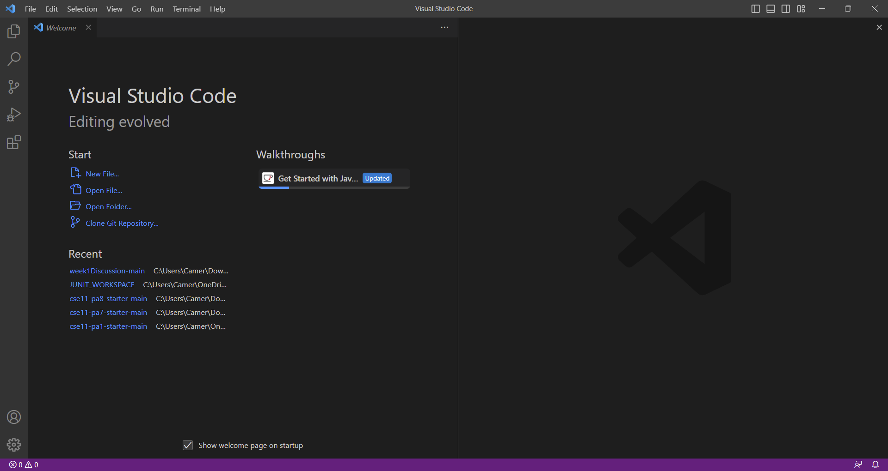
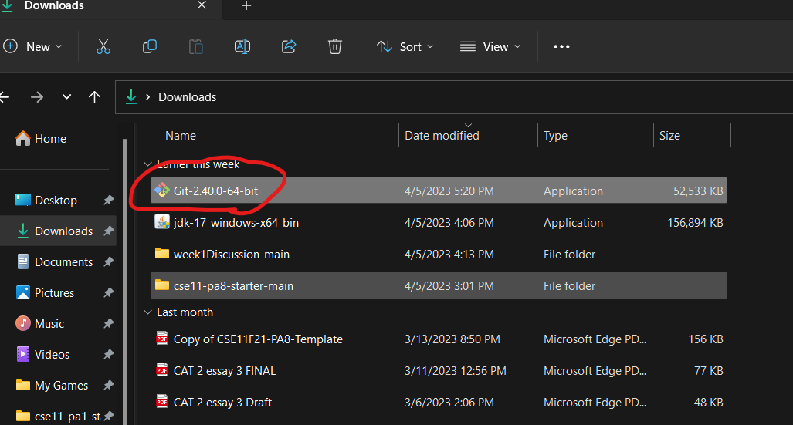
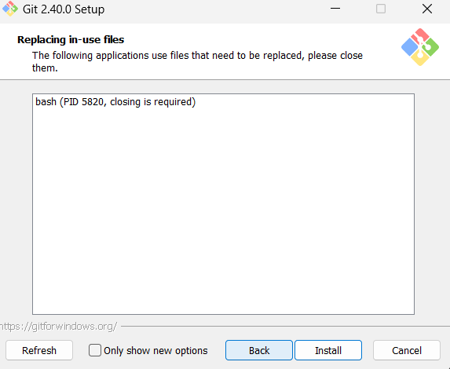

# Lab Report 1 - Remote Access and FileSystem

## Step 1: Installing Visual Studio Code

1. Click on this link to go to the download page for VScode: [Visual Studio Code Download](https://code.visualstudio.com/Download)
2. Next, select the download for your operating system. (I will be showing the Windows version) 

3. Go to your downloads and double-click on the VSCodeUserSetup. 

4. Accept the terms and click next until you see install. 
!
5. Click install.

6. Finally, open Visual Studio Code. 

## Step 2: Remotely Connecting With Course-Specific Account on ieng6

1. Download git: [git Download](https://github.com/git-for-windows/git/releases/download/v2.40.0.windows.1/Git-2.40.0-64-bit.exe)
2. Go to your downloads and double-click on the git installer. 

3. Hit next without changing anything. Then, click install. 

4. 

