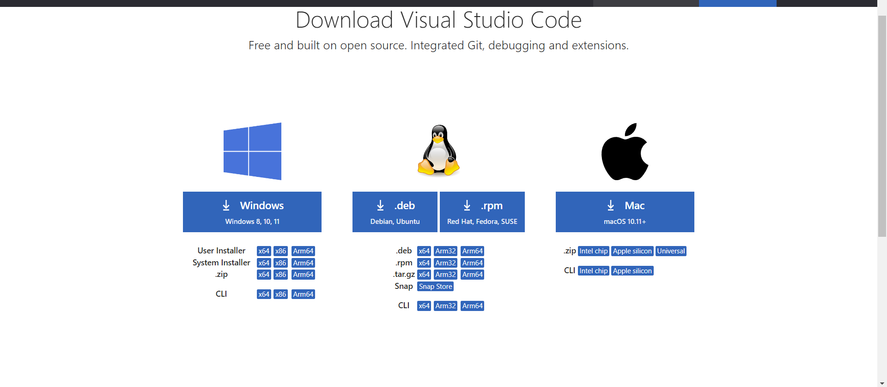
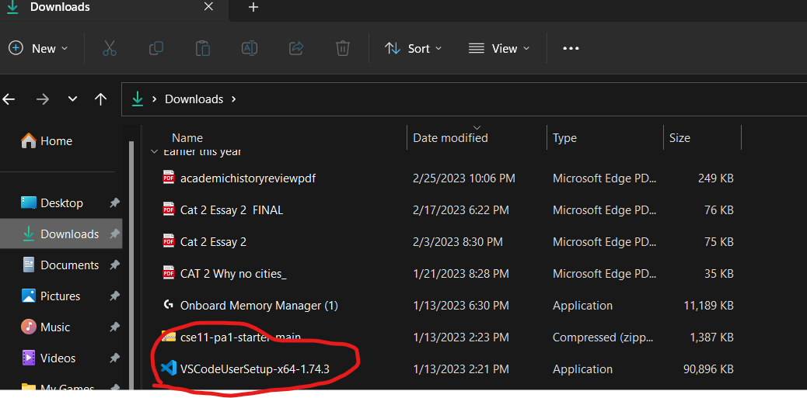
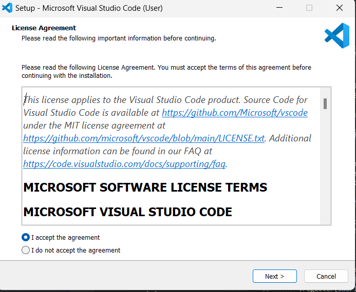
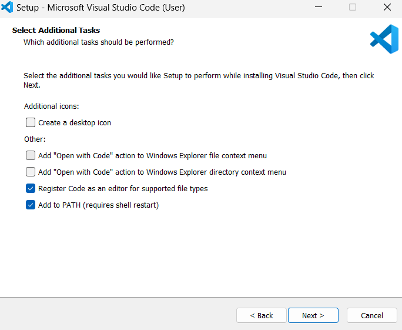
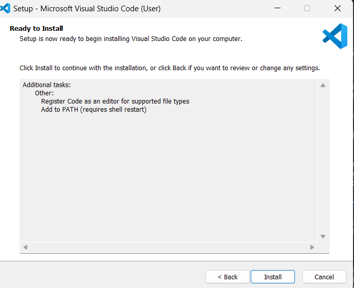

# Lab Report 1

## Step 1: Installing Visual Studio Code

1. Click on this link to go to the download page for VScode: [Visual Studio Code Download](https://code.visualstudio.com/Download)
2. Next, select the download for your operating system. (I will be showing the Windows version) 
3. Finally, go to your downloads and double-click on the VSCodeUserSetup. Accept the terms and click next until you see install. Then, click install. 
