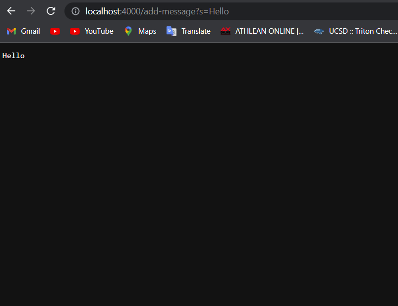
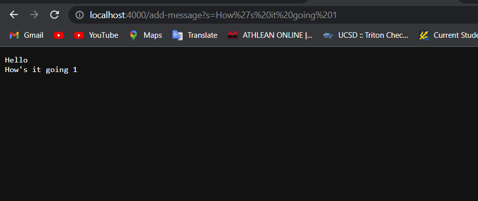
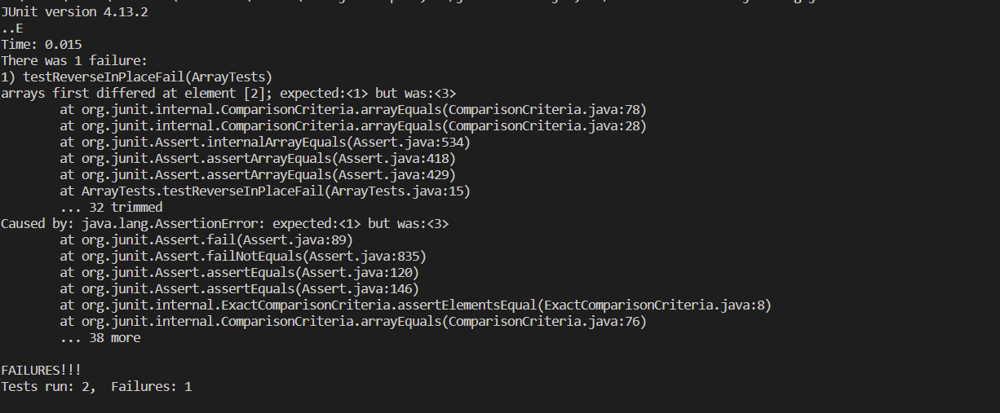

# Lab Report 2 - Servers and Bugs

## Part 1 - Web Server

This is my code for my web server called `StringServer`
```
import java.io.IOException;
import java.net.URI;

class Handler3 implements URLHandler {
    
    String str = "";

    public String handleRequest(URI url) {
        if (url.getPath().equals("/")) {
            return String.format("%s", str);
        }

        else {
            System.out.println("Path: " + url.getPath());
            if (url.getPath().contains("/add-message")) {
                String[] parameters = url.getQuery().split("=");
                if (parameters[0].equals("s")) {
                    str += parameters[1]+ "\n";
                    
                    return String.format("%s",str);
                }
            }
            return "404 Not Found!";
        }
    }
}

class StringServer {
    public static void main(String[] args) throws IOException {
        if(args.length == 0){
            System.out.println("Missing port number! Try any number between 1024 to 49151");
            return;
        }

        int port = Integer.parseInt(args[0]);

        Server.start(port, new Handler3());
    }
}
```

The first message I added was "Hello" to my web server.

Methods called: `handleRequest` is called when adding the message "Hello".

Arguement to `handleRequest`: "http://localhost:4000/add-message?s=Hello" is the argument passed to `handleRequest`.

Relevant Fields: `String[] parameters` holds the query which is split by "=" so it contains "s" in the first index and "Hello" in the second index. 
                 `String str` holds all of the messages added to the web server and starts out as "". After the `handleRequest` is called, `str` contains "Hello\n".



The second message I added was "How's it going 1" to my web server.

Methods called: `handleRequest` is called when adding the message "How's it going 1".

Arguement to `handleRequest`: "http://localhost:4000/add-message?s=How's it going 1" is the argument passed to `handleRequest`.

Relevant Fields: `String[] parameters` contains "s" in the first index and "How's it going 1" in the second index. 
                 `String str` contains previously added messages so it contains "Hello\n". After the `handleRequest` is called again, `str` contains "Hello\nHow's it going 1\n".



## Part 2 - Bugs

**Buggy Program:**
```
static void reverseInPlace(int[] arr) {
    for(int i = 0; i < arr.length; i += 1) {
      arr[i] = arr[arr.length - i - 1];
    }
  }
```

**Failure Inducing Input:** 
```
@Test 
	public void testReverseInPlaceFail() {
    int[] input2 = {1,2,3};
    ArrayExamples.reverseInPlace(input2);
    assertArrayEquals(new int[]{ 3,2,1 }, input2);
	}
```

**Non-Failure Inducing Input:**
```
@Test 
	public void testReverseInPlaceNonFail() {
    int[] input1 = { 3 };
    ArrayExamples.reverseInPlace(input1);
    assertArrayEquals(new int[]{ 3 }, input1);
```

**Symptom:**

