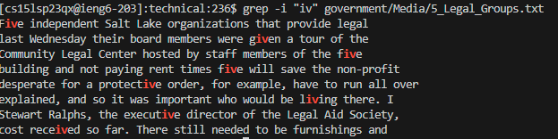

# Lab Report 3 - `grep` Command-line Options

## How to use `grep`

**Formatting:** `grep <Options> <Pattern> <FileName>`

`grep` is used to print out lines within designated file that match the given pattern.

## Option 1 - `-i`

This command-line option ignores the case of the letters, so the pattern given will match with the same characters regardless if their cases match or not. This could be useful when needing to find lines that match a pattern but you are unsure if the pattern in the lines have capital letters or not.

[Citation}(https://man7.org/linux/man-pages/man1/grep.1.html)

**Example 1:**

