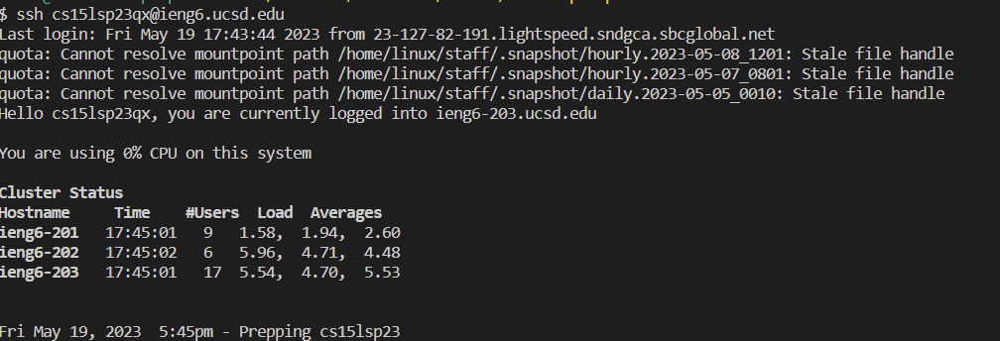

# Lab Report 4 - Explaining Keystrokes

## Task 1: Log into ieng6

**Keys pressed:** s s h `<space>` c s 1 5 l s p 2 3 q x @ I E N G 6 . u c s d . e d u `<enter>`

**Description:** The `ssh` command along with my username was entered to log into ieng.

## Task 2: Clone your fork of the repository from your Github account

**Keys pressed:** g i t `<space>` c l o n e `<ctrl v>` `<enter>`

**Description:** The `git clone` command was used to clone the specified repository to my ieng account. `<ctrl v>` was used to paste `https://github.com/CameronArch/lab7.git` which I previously had copied on my clipboard.

## Task 3: Run the tests, demonstrating that they fail

**Keys pressed:** c d `<space>` l a b 7 `<enter>` b a s h `<space>` t e s t . s h `<enter>`

**Description:** I first changed my working directory to be `lab7` with the command `cd`. Then, I ran the tests with `bash test.sh`.

## Task 4: Edit the code file to fix the failing test

**Keys pressed:** v i m `<space>` L `<tab>` . j a v a `<enter>` ? i `<enter>` e r 2 : w q `<enter>`

**Description:**

## Task 5: Run the tests, demonstrating that they now succeed

**Keys pressed:**

**Description:**

## Task 6: Commit and push the resulting change to your Github account

**Keys pressed:**

**Description:**

