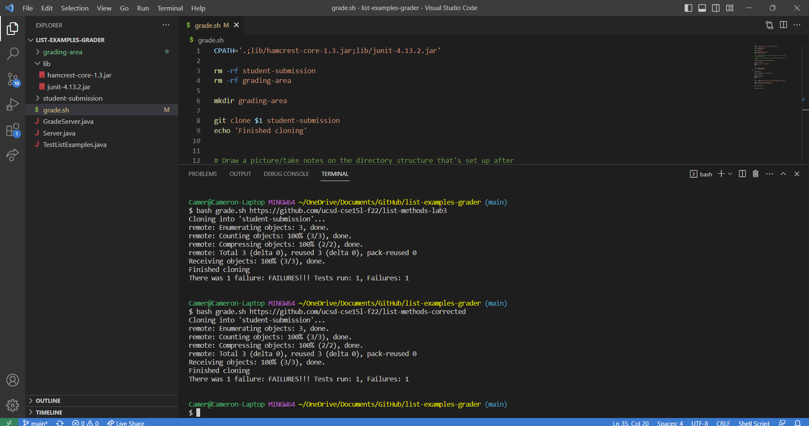
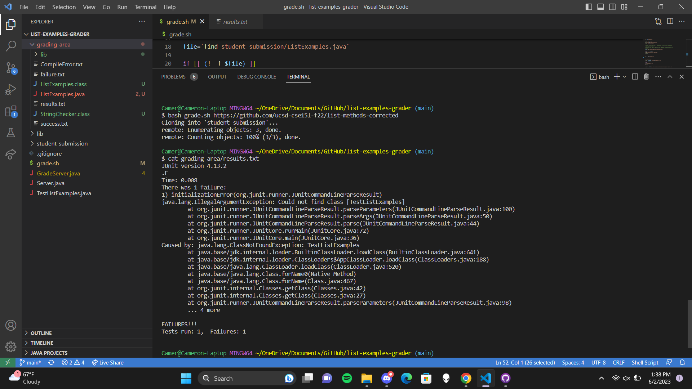
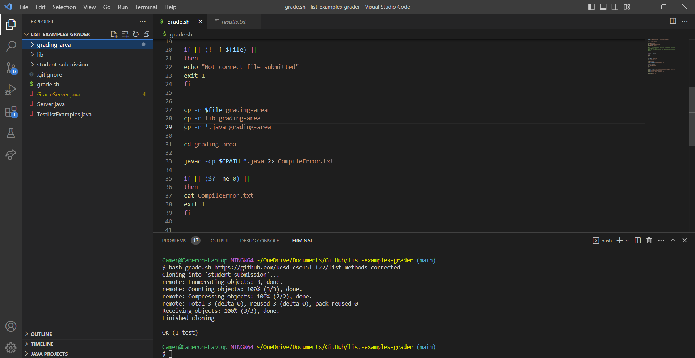

# Lab Report 5 - Debugging Scenario

## Student Debugging Post

**1) Environment:** 
Operating system = Windows 11, Editor = Visual Studio Code, Terminal = Git Bash in VS Code

**2) Symptom:** 
 
``` 
Camer@Cameron-Laptop MINGW64 ~/OneDrive/Documents/GitHub/list-examples-grader (main)
$ bash grade.sh https://github.com/ucsd-cse15l-f22/list-methods-corrected
Cloning into 'student-submission'...
remote: Enumerating objects: 3, done.
remote: Counting objects: 100% (3/3), done.
remote: Compressing objects: 100% (2/2), done.
remote: Total 3 (delta 0), reused 3 (delta 0), pack-reused 0
Receiving objects: 100% (3/3), done.
Finished cloning
There was 1 failure: FAILURES!!! Tests run: 1, Failures: 1
```
Expected: All tests should pass on the `https://github.com/ucsd-cse15l-f22/list-methods-corrected` student submission because it is the correct implementation of `ListExamples`. The tests should fail the `https://github.com/ucsd-cse15l-f22/list-methods-lab3` student submission because it is an incorrect implementation of `ListExamples`.

Actual: Both `https://github.com/ucsd-cse15l-f22/list-methods-corrected` and `https://github.com/ucsd-cse15l-f22/list-methods-lab3` student submissions fail the tests for `ListExamples`.

**3) Failure-Inducing Input and Context:** 
Failure-inducing input: `https://github.com/ucsd-cse15l-f22/list-methods-corrected`

The commands used: `bash grade.sh https://github.com/ucsd-cse15l-f22/list-methods-corrected` and `bash grade.sh https://github.com/ucsd-cse15l-f22/list-methods-lab3`

Working Directory: `list-examples-grader`

Last commands ran: None, this is a new terminal

`TestListExamples.java` is unchanged compared to given file.

 `grade.sh` Script: 
 ```
 CPATH='.;lib/hamcrest-core-1.3.jar;lib/junit-4.13.2.jar'

rm -rf student-submission
rm -rf grading-area

mkdir grading-area

git clone $1 student-submission
echo 'Finished cloning'


# Draw a picture/take notes on the directory structure that's set up after
# getting to this point

# Then, add here code to compile and run, and do any post-processing of the
# tests

file=`find student-submission/ListExamples.java`

if [[ (! -f $file) ]]
then 
echo "Not correct file submitted"
exit 1 
fi


cp -r $file grading-area
cp -r lib grading-area


cd grading-area

javac -cp $CPATH *.java 2> CompileError.txt

if [[ ($? -ne 0) ]]
then
cat CompileError.txt
exit 1
fi


java -cp $CPATH org.junit.runner.JUnitCore TestListExamples > results.txt

grep -i "OK" results.txt > success.txt
grep -i "Failure" results.txt > failure.txt


echo `cat failure.txt`


echo `cat success.txt`
```

## TA Response

First, run `bash grade.sh https://github.com/ucsd-cse15l-f22/list-methods-corrected`. Then, show what is contained in result.txt with `cat grading-area/result.txt`. Finally, send a screenshot of the terminal output or a copy of the output.

## Student Reply


```
Camer@Cameron-Laptop MINGW64 ~/OneDrive/Documents/GitHub/list-examples-grader (main)
$ bash grade.sh https://github.com/ucsd-cse15l-f22/list-methods-corrected
Cloning into 'student-submission'...
remote: Enumerating objects: 3, done.
remote: Counting objects: 100% (3/3), done.

Camer@Cameron-Laptop MINGW64 ~/OneDrive/Documents/GitHub/list-examples-grader (main)
$ cat grading-area/results.txt
JUnit version 4.13.2
.E
Time: 0.008
There was 1 failure:
1) initializationError(org.junit.runner.JUnitCommandLineParseResult)
java.lang.IllegalArgumentException: Could not find class [TestListExamples]
        at org.junit.runner.JUnitCommandLineParseResult.parseParameters(JUnitCommandLineParseResult.java:100)
        at org.junit.runner.JUnitCommandLineParseResult.parseArgs(JUnitCommandLineParseResult.java:50)
        at org.junit.runner.JUnitCommandLineParseResult.parse(JUnitCommandLineParseResult.java:44)
        at org.junit.runner.JUnitCore.runMain(JUnitCore.java:72)
        at org.junit.runner.JUnitCore.main(JUnitCore.java:36)
Caused by: java.lang.ClassNotFoundException: TestListExamples
        at java.base/jdk.internal.loader.BuiltinClassLoader.loadClass(BuiltinClassLoader.java:641)
        at java.base/jdk.internal.loader.ClassLoaders$AppClassLoader.loadClass(ClassLoaders.java:188)
        at java.base/java.lang.ClassLoader.loadClass(ClassLoader.java:520)
        at java.base/java.lang.Class.forName0(Native Method)
        at java.base/java.lang.Class.forName(Class.java:467)
        at org.junit.internal.Classes.getClass(Classes.java:42)
        at org.junit.internal.Classes.getClass(Classes.java:27)
        at org.junit.runner.JUnitCommandLineParseResult.parseParameters(JUnitCommandLineParseResult.java:98)
        ... 4 more

FAILURES!!!
Tests run: 1,  Failures: 1
```

## TA Response - Solution

It appears that the file `TestListExamples.java` is within the `grading-area` directory. This means there are not any tests being ran on the student submission of `ListExamples.java`. The bug is that `TestListExamples.java` does not exist in the `grading-area` directory where the student submission is contained, so there is not a file for testing the submission.

Solution: In your `grade.sh` script, you need to copy `TestListExamples.java` into `grading-area` as well which should fix the bug.

## Student Reply - Bug Fixed

Thank you! It is working as expected now.



## The Setup

**Directories Needed:** `list-examples-grader`, `lib`

**Files/Directories Contained in `list-examples-grader`:** `lib`, `grade.sh`, `GradeServer.java`, `TestListExamples.java`, `Server.java`, `.gitignore`

**Files Needed and Contained in `lib`:** `junit-4.13.2.jar`, `hamcrest-core-1.3.jar`

**Contents of Files Before Bug**

`grade.sh`:
```
CPATH='.;lib/hamcrest-core-1.3.jar;lib/junit-4.13.2.jar'

rm -rf student-submission
rm -rf grading-area

mkdir grading-area

git clone $1 student-submission
echo 'Finished cloning'


# Draw a picture/take notes on the directory structure that's set up after
# getting to this point

# Then, add here code to compile and run, and do any post-processing of the
# tests

file=`find student-submission/ListExamples.java`

if [[ (! -f $file) ]]
then 
echo "Not correct file submitted"
exit 1 
fi


cp -r $file grading-area
cp -r lib grading-area

cd grading-area

javac -cp $CPATH *.java 2> CompileError.txt

if [[ ($? -ne 0) ]]
then
cat CompileError.txt
exit 1
fi


java -cp $CPATH org.junit.runner.JUnitCore TestListExamples > results.txt

grep -i "OK" results.txt > success.txt
grep -i "Failure" results.txt > failure.txt


echo `cat failure.txt`


echo `cat success.txt`
```

`TestListExamples.java`:
```
import static org.junit.Assert.*;
import org.junit.*;
import java.util.Arrays;
import java.util.List;

class IsMoon implements StringChecker {
  public boolean checkString(String s) {
    return s.equalsIgnoreCase("moon");
  }
}

public class TestListExamples {
  @Test(timeout = 500)
  public void testMergeRightEnd() {
    List<String> left = Arrays.asList("a", "b", "c");
    List<String> right = Arrays.asList("a", "d");
    List<String> merged = ListExamples.merge(left, right);
    List<String> expected = Arrays.asList("a", "a", "b", "c", "d");
    assertEquals(expected, merged);
  }
}
```

`GradeServer.java`:
```
import java.io.BufferedReader;
import java.io.IOException;
import java.io.InputStream;
import java.io.InputStreamReader;
import java.net.URI;
import java.net.URISyntaxException;
import java.util.Arrays;
import java.util.stream.Stream;

class ExecHelpers {

  /**
    Takes an input stream, reads the full stream, and returns the result as a
    string.

    In Java 9 and later, new String(out.readAllBytes()) would be a better
    option, but using Java 8 for compatibility with ieng6.
  */
  static String streamToString(InputStream out) throws IOException {
    String result = "";
    while(true) {
      int c = out.read();
      if(c == -1) { break; }
      result += (char)c;
    }
    return result;
  }

  /**
    Takes a command, represented as an array of strings as it would by typed at
    the command line, runs it, and returns its combined stdout and stderr as a
    string.
  */
  static String exec(String[] cmd) throws IOException {
    Process p = new ProcessBuilder()
                    .command(Arrays.asList(cmd))
                    .redirectErrorStream(true)
                    .start();
    InputStream outputOfBash = p.getInputStream();
    return String.format("%s\n", streamToString(outputOfBash));
  }

}

class Handler implements URLHandler {
    public String handleRequest(URI url) throws IOException {
       if (url.getPath().equals("/grade")) {
           String[] parameters = url.getQuery().split("=");
           if (parameters[0].equals("repo")) {
               String[] cmd = {"bash", "grade.sh", parameters[1]};
               String result = ExecHelpers.exec(cmd);
               return result;
           }
           else {
               return "Couldn't find query parameter repo";
           }
       }
       else {
           return "Don't know how to handle that path!";
       }
    }
}

class GradeServer {
    public static void main(String[] args) throws IOException {
        if(args.length == 0){
            System.out.println("Missing port number! Try any number between 1024 to 49151");
            return;
        }

        int port = Integer.parseInt(args[0]);

        Server.start(port, new Handler());
    }
}

class ExecExamples {
  public static void main(String[] args) throws IOException {
    String[] cmd1 = {"ls", "lib"};
    System.out.println(ExecHelpers.exec(cmd1));

    String[] cmd2 = {"pwd"};
    System.out.println(ExecHelpers.exec(cmd2));

    String[] cmd3 = {"touch", "a-new-file.txt"};
    System.out.println(ExecHelpers.exec(cmd3));
  }
}
```

`Server.java`:
```
// A simple web server using Java's built-in HttpServer

// Examples from https://dzone.com/articles/simple-http-server-in-java were useful references

import java.io.IOException;
import java.io.OutputStream;
import java.net.InetSocketAddress;
import java.net.URI;

import com.sun.net.httpserver.HttpExchange;
import com.sun.net.httpserver.HttpHandler;
import com.sun.net.httpserver.HttpServer;

interface URLHandler {
    String handleRequest(URI url) throws IOException;
}

class ServerHttpHandler implements HttpHandler {
    URLHandler handler;
    ServerHttpHandler(URLHandler handler) {
      this.handler = handler;
    }
    public void handle(final HttpExchange exchange) throws IOException {
        // form return body after being handled by program
        try {
            String ret = handler.handleRequest(exchange.getRequestURI());
            // form the return string and write it on the browser
            exchange.sendResponseHeaders(200, ret.getBytes().length);
            OutputStream os = exchange.getResponseBody();
            os.write(ret.getBytes());
            os.close();
        } catch(Exception e) {
            String response = e.toString();
            exchange.sendResponseHeaders(500, response.getBytes().length);
            OutputStream os = exchange.getResponseBody();
            os.write(response.getBytes());
            os.close();
        }
    }
}

public class Server {
    public static void start(int port, URLHandler handler) throws IOException {
        HttpServer server = HttpServer.create(new InetSocketAddress(port), 0);

        //create request entrypoint
        server.createContext("/", new ServerHttpHandler(handler));

        //start the server
        server.start();
        System.out.println("Server Started! Visit http://localhost:" + port + " to visit.");
    }
}
```

`.gitignore`:
```
*.class 
*.txt
grading-area
```

**Command Line to Trigger Bug**

`bash grade.sh https://github.com/ucsd-cse15l-f22/list-methods-corrected`

**Bug Fix**

To fix the bug, `grade.sh` needs to be edited. It needs an additional line of code to copy `ListExamples.java` into `grading-area`. The line of code to add is `cp -r *.java grading-area` and it need to be placed with the other lines of code that copy files into `grading area`. 

Lines of code the for fix to be placed with:
```
cp -r $file grading-area
cp -r lib grading-area
```

`grade.sh` without the bug should look something like this:
```
CPATH='.;lib/hamcrest-core-1.3.jar;lib/junit-4.13.2.jar'

rm -rf student-submission
rm -rf grading-area

mkdir grading-area

git clone $1 student-submission
echo 'Finished cloning'


# Draw a picture/take notes on the directory structure that's set up after
# getting to this point

# Then, add here code to compile and run, and do any post-processing of the
# tests

file=`find student-submission/ListExamples.java`

if [[ (! -f $file) ]]
then 
echo "Not correct file submitted"
exit 1 
fi


cp -r $file grading-area
cp -r lib grading-area
cp -r *.java grading-area

cd grading-area

javac -cp $CPATH *.java 2> CompileError.txt

if [[ ($? -ne 0) ]]
then
cat CompileError.txt
exit 1
fi


java -cp $CPATH org.junit.runner.JUnitCore TestListExamples > results.txt

grep -i "OK" results.txt > success.txt
grep -i "Failure" results.txt > failure.txt


echo `cat failure.txt`


echo `cat success.txt`
```

